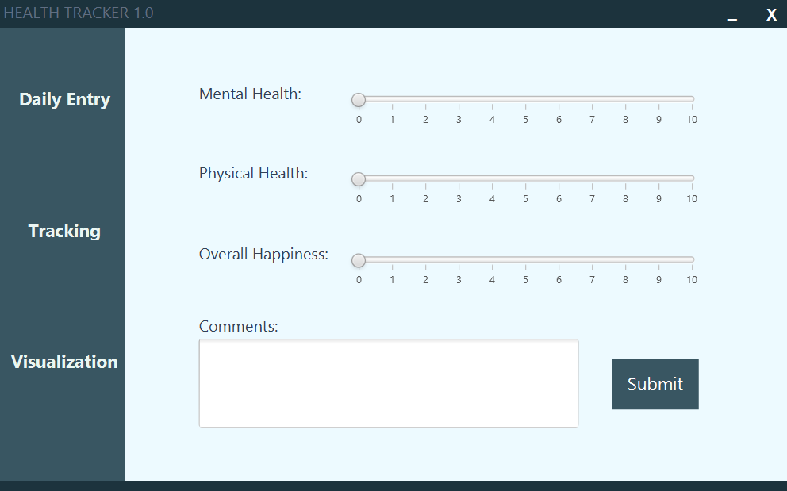

# HealthTracker
HealthTracker is a personal desktop application that tracks daily health data. Requires _JRE 8_ or above to run.

Built with JavaFX

# Installation
1. Clone the directory or directly download _"HealthTrackerBuild.zip"_
2. Unzip _"HealthTrackerBuild.zip"_
3. Double click _"run.bat"_

# Preview:

# From the Author
This was a fun project that helped me learn JavaFX and MVC UI design principles.
